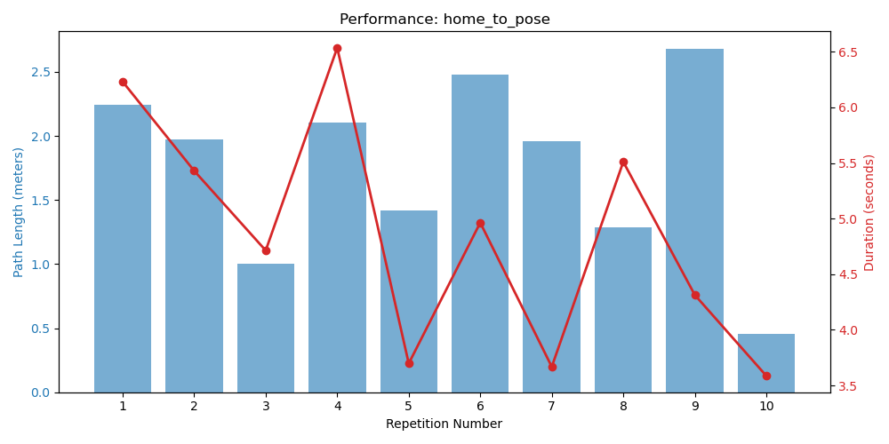
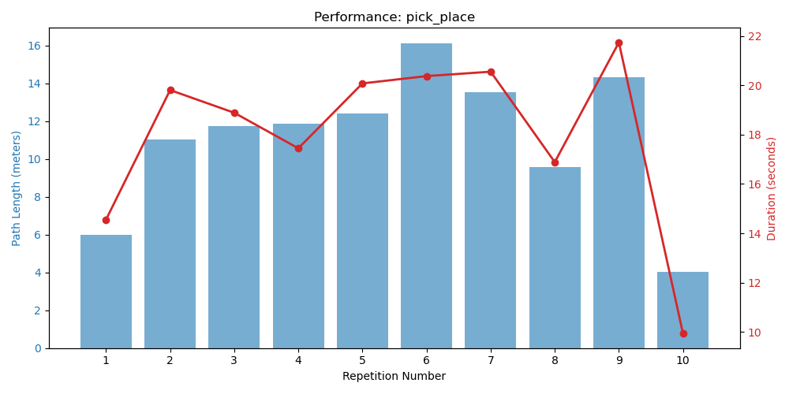
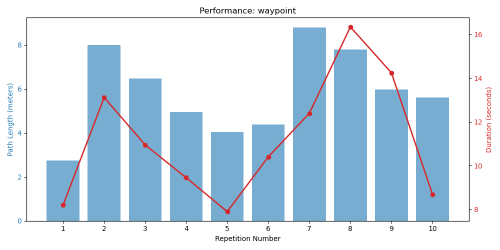

# Automated Experiment Report

## Scenario: HOME_TO_POSE

### Performance Graph

### Results Table
| Repetition | Duration | Path Length | Target Error | Success |
|---|---|---|---|---|
| exp_home_to_pose_rep1 | 6.2303s | 2.2463m | 0.007547m | **Success** |
| exp_home_to_pose_rep2 | 5.4294s | 1.9763m | 0.005094m | **Success** |
| exp_home_to_pose_rep3 | 4.7134s | 1.0037m | 0.008379m | **Success** |
| exp_home_to_pose_rep4 | 6.5353s | 2.1065m | 0.007959m | **Success** |
| exp_home_to_pose_rep5 | 3.698s | 1.4168m | 0.008904m | **Success** |
| exp_home_to_pose_rep6 | 4.9636s | 2.4822m | 0.00906m | **Success** |
| exp_home_to_pose_rep7 | 3.6683s | 1.9575m | 0.008956m | **Success** |
| exp_home_to_pose_rep8 | 5.5101s | 1.2863m | 0.002831m | **Success** |
| exp_home_to_pose_rep9 | 4.3139s | 2.682m | 0.009942m | **Success** |
| exp_home_to_pose_rep10 | 3.5868s | 0.4581m | 0.007798m | **Success** |

---

## Scenario: PICK_PLACE

### Performance Graph

### Results Table
| Repetition | Duration | Path Length | Target Error | Success |
|---|---|---|---|---|
| exp_pick_place_rep1 | 14.5531s | 6.0039m | 0.008689m | **Success** |
| exp_pick_place_rep2 | 19.8104s | 11.0205m | 0.006963m | **Success** |
| exp_pick_place_rep3 | 18.8895s | 11.7452m | 0.009323m | **Success** |
| exp_pick_place_rep4 | 17.4478s | 11.8713m | 0.008326m | **Success** |
| exp_pick_place_rep5 | 20.0801s | 12.4026m | 0.009208m | **Success** |
| exp_pick_place_rep6 | 20.3772s | 16.1234m | 0.008007m | **Success** |
| exp_pick_place_rep7 | 20.5551s | 13.5432m | 0.006778m | **Success** |
| exp_pick_place_rep8 | 16.8879s | 9.5803m | 0.009563m | **Success** |
| exp_pick_place_rep9 | 21.7433s | 14.3148m | 0.008382m | **Success** |
| exp_pick_place_rep10 | 9.9351s | 4.0107m | 0.009445m | **Success** |

---

## Scenario: WAYPOINT

### Performance Graph

### Results Table
| Repetition | Duration | Path Length | Target Error | Success |
|---|---|---|---|---|
| exp_waypoint_rep1 | 8.2004s | 2.7354m | 0.006646m | **Success** |
| exp_waypoint_rep2 | 13.1169s | 7.9878m | 0.002828m | **Success** |
| exp_waypoint_rep3 | 10.9485s | 6.4845m | 0.00963m | **Success** |
| exp_waypoint_rep4 | 9.4502s | 4.9448m | 0.005178m | **Success** |
| exp_waypoint_rep5 | 7.9024s | 4.0472m | 0.00365m | **Success** |
| exp_waypoint_rep6 | 10.4031s | 4.3907m | 0.008105m | **Success** |
| exp_waypoint_rep7 | 12.3925s | 8.7996m | 0.008337m | **Success** |
| exp_waypoint_rep8 | 16.3366s | 7.7978m | 0.009031m | **Success** |
| exp_waypoint_rep9 | 14.241s | 5.9697m | 0.001563m | **Success** |
| exp_waypoint_rep10 | 8.6955s | 5.6024m | 0.007164m | **Success** |

---

