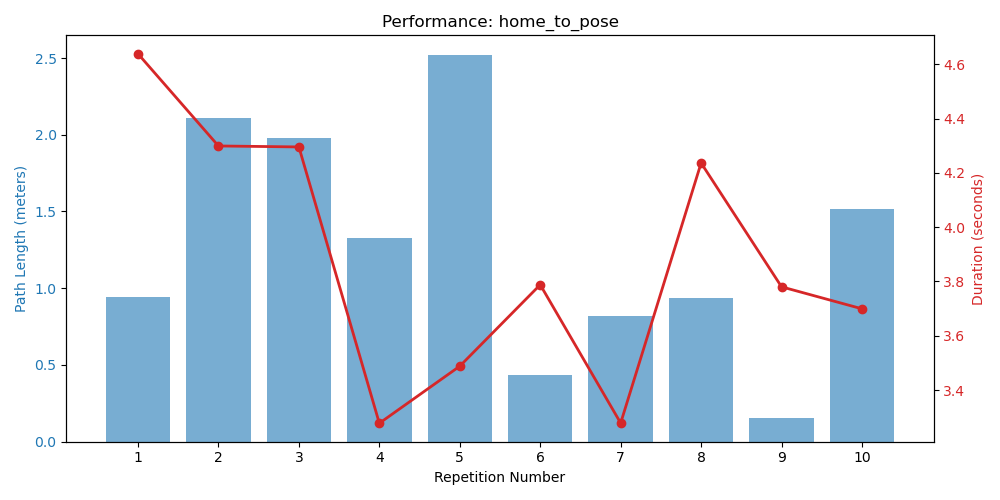

# Automated Experiment Report

## Scenario: HOME_TO_POSE

### Performance Graph

### Results Table
| Repetition | Duration | Path Length | Target Error | Success |
|---|---|---|---|---|
| exp_home_to_pose_rep1 | 4.639s | 0.9404m | 0.002293m | **Success** |
| exp_home_to_pose_rep2 | 4.2994s | 2.1084m | 0.006826m | **Success** |
| exp_home_to_pose_rep3 | 4.2958s | 1.9768m | 0.008401m | **Success** |
| exp_home_to_pose_rep4 | 3.2776s | 1.3268m | 0.001m | **Success** |
| exp_home_to_pose_rep5 | 3.4879s | 2.5216m | 0.002777m | **Success** |
| exp_home_to_pose_rep6 | 3.7881s | 0.4338m | 0.008012m | **Success** |
| exp_home_to_pose_rep7 | 3.2783s | 0.8194m | 0.00668m | **Success** |
| exp_home_to_pose_rep8 | 4.2367s | 0.937m | 0.009679m | **Success** |
| exp_home_to_pose_rep9 | 3.7803s | 0.1558m | 0.007727m | **Success** |
| exp_home_to_pose_rep10 | 3.6993s | 1.5152m | 0.008773m | **Success** |

---

