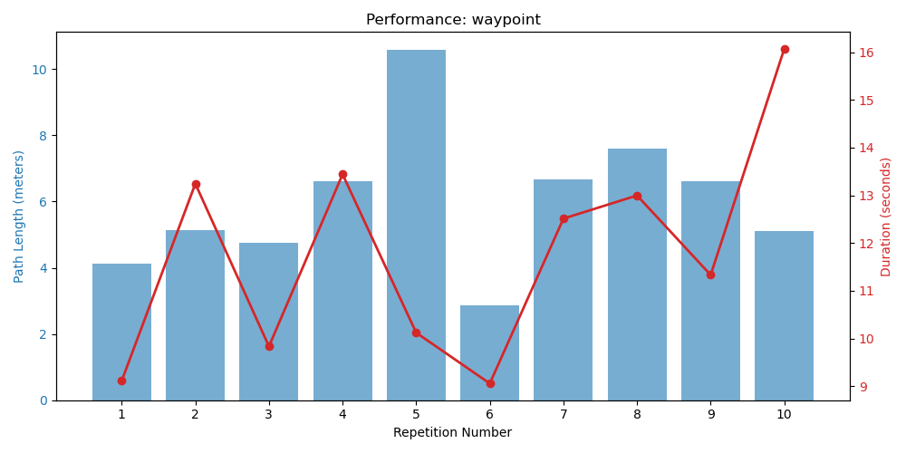

# Automated Experiment Report

## Scenario: WAYPOINT

### Performance Graph

### Results Table
| Repetition | Duration | Path Length | Target Error | Success |
|---|---|---|---|---|
| exp_waypoint_rep1 | 9.1105s | 4.1212m | 0.004085m | **Success** |
| exp_waypoint_rep2 | 13.2442s | 5.1399m | 0.009508m | **Success** |
| exp_waypoint_rep3 | 9.8322s | 4.7573m | 0.004916m | **Success** |
| exp_waypoint_rep4 | 13.4413s | 6.6032m | 0.009888m | **Success** |
| exp_waypoint_rep5 | 10.1193s | 10.593m | 0.008668m | **Success** |
| exp_waypoint_rep6 | 9.055s | 2.8631m | 0.006738m | **Success** |
| exp_waypoint_rep7 | 12.5122s | 6.6744m | 0.004219m | **Success** |
| exp_waypoint_rep8 | 12.9974s | 7.5998m | 0.005186m | **Success** |
| exp_waypoint_rep9 | 11.3305s | 6.6213m | 0.004773m | **Success** |
| exp_waypoint_rep10 | 16.0742s | 5.1051m | 0.001288m | **Success** |

---

